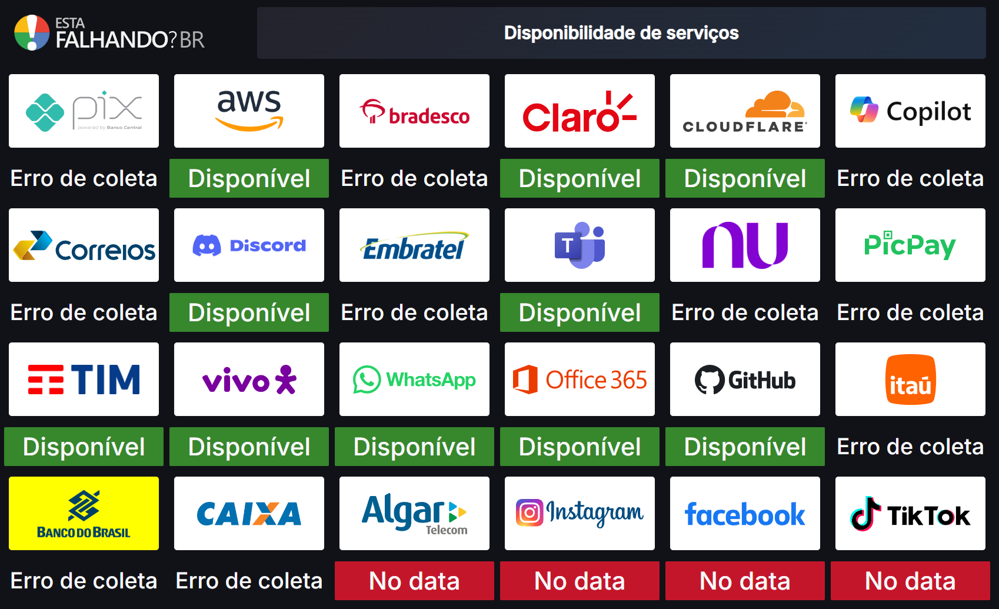

# 📡 newDownDetector.py

  

Script Python para monitorar o status de serviços no site [istheservicedown.com.br](https://istheservicedown.com.br).

  

Ele retorna:

-  `0` — Serviço funcionando normalmente

-  `1` — Alguns problemas detectados (instabilidade parcial)

-  `2` — Serviço fora do ar (problemas graves)

-  `3` — Erro ao acessar ou status indefinido

  

---

  

## 🚀 Como Funciona

  

O script acessa a página de status de cada serviço em tempo real, faz scraping da informação e classifica automaticamente o estado.

  

**Exemplo de uso:**

  

```bash

./newDownDetector.py  youtube

```

  

**Resposta esperada:**

  

```

0

```

  

**Outro exemplo:**

  

```bash

./newDownDetector.py  netflix

```

  

**Resposta:**

  

```

1

```

  

---

  

## 🛠️ Requisitos

  

Antes de usar, instale as bibliotecas necessárias:

  

```bash

pip  install  cloudscraper  beautifulsoup4

```

  

Essas bibliotecas são usadas para:

-  **cloudscraper**: Permite acesso a sites protegidos por Cloudflare.

-  **beautifulsoup4**: Faz o parsing do conteúdo HTML para extração dos dados.

    

## 🧩 Integração com Zabbix

  

1. Copie o script para o diretório de scripts externos do Zabbix:
(*/usr/lib/zabbix/externalscripts/*)
```bash

sudo  chmod  +x newDownDetector.py
sudo  chown  zabbix newDownDetector.py

```

2. No Zabbix, importe o arquivo **zbx_export_templates.yaml** adicionar o template que adicionará a configuração de coleta aos hosts:

3. Em seguida importe o arquivo **zbx_export_hosts.yaml** para adicionar alguns hosts de teste:

  -   `youtube`
    
-   `netflix`
    
-   `vivo-brasil`
    
-   `pix`
    
-   `whatsapp-messenger`
    
-   `discord`
    
-   `nubank`
    
-   `bradesco`
    
-   `cloudflare`
    
-   `correios`
    
-   `copilot`
    
-   `amazon-web-services-aws`
    
-   `tim-brasil`
    
-   `claro-brasil`
    
-   `embratel`

**Importante:** Caso queira adicionar os hosts manualmente, basta criar o host exatamente com o nome do serviço monitorado em  [`Esta Falhando?`](https://istheservicedown.com.br/), dessa forma, adicionando o template importado, o host já estará configurado.
  
**Ps:** O nome do serviço fica no final do link. Ex: https://istheservicedown.com.br/status/**youtube**

---

## 🧩 Grafana  

Importe o arquivo Downdetector.json e ajuste o datasource para iniciar o monitoramento, ficando assim:


### 📢 Observação final
Essa é uma alternativa ao Downdetector após os últimos bloqueios aplicado ao Cloudflare.
Atualizações serão implementadas conforme descobertas.